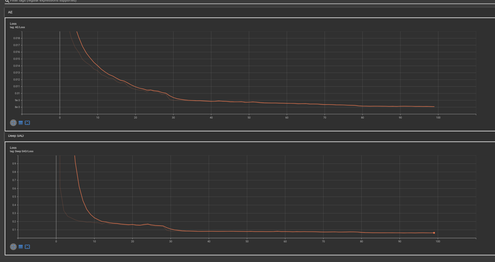

# DeepSAD pytorch version

## 1. Overview

This is implementation from Deep semi-supervised Anomaly detection paper to pytorch version

I use **CIFAR10 dataaset**

## 1. How to run?

- Check the parser's parameters in main.py
- ``` python3 main.py ```

## 2. Environment

```
python version = 3.6.8 (Recommand)

torch                   1.7.1+cu110
torchaudio              0.7.2
torchsummary            1.5.1
torchvision             0.8.2+cu110
tqdm                    4.61.2
imageio                 2.9.0
scikit-learn            0.24.2
numpy                   1.16.6
```

## 3. Result

Model | train loss| test loss | AUROC
------|-------|------|------
AUTOENCODER (epoch 50)| 0.00807|0.010426|66.50%
Deep SVDD (epoch 100)| 0.06367|0.061671|77.30%
### Tensorboard result


## 4. Reference
https://arxiv.org/abs/1906.02694 [Official paper]

https://github.com/lukasruff/Deep-SAD-PyTorch [Official paper code]

https://ys-cs17.tistory.com/51 [My paper review blog]
